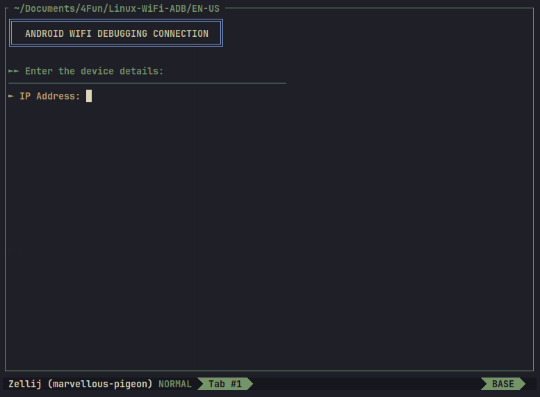
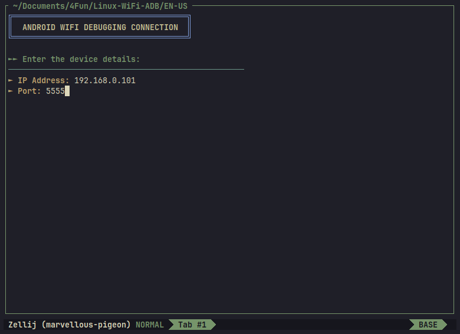
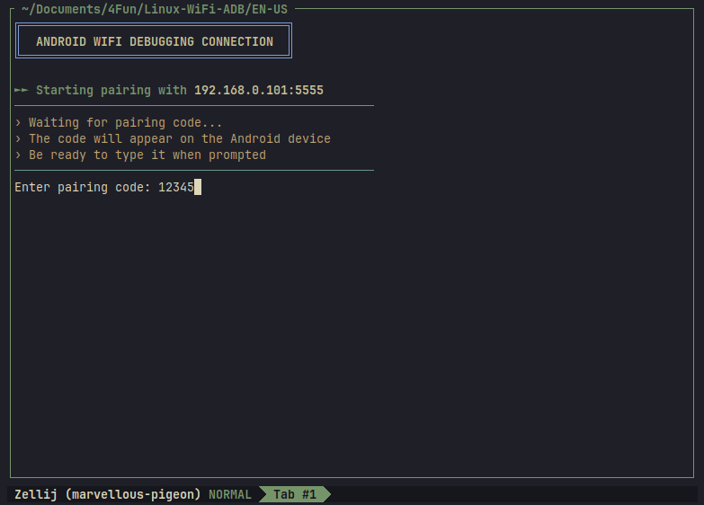
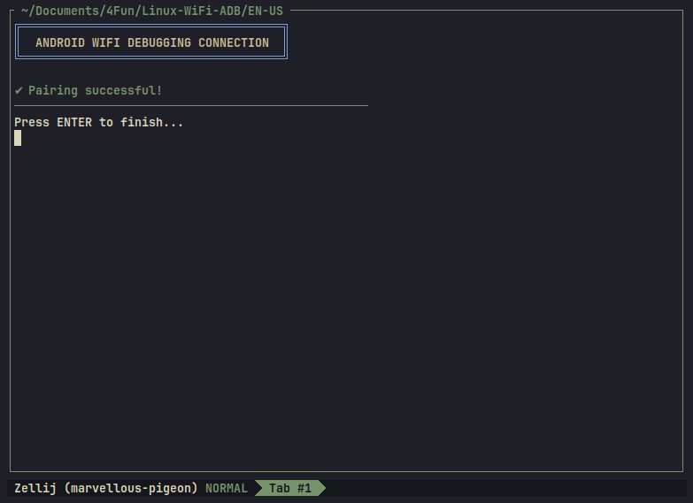

# Linux-WiFi-ADB

[](https://choosealicense.com/licenses/mit/)

A user-friendly tool to facilitate WiFi debugging connections between Android devices and Linux systems.





## 📋 Features
- User-friendly interface for managing ADB connections via WiFi
- Support for multiple languages (PT-BR and EN-US)
- Simplified device pairing process
- Customizable shortcuts for quick access

## ✅ Prerequisites
- Android SDK (with platform-tools)
- Git (`sudo apt install git` for Debian/Ubuntu)
- USB Debugging enabled on Android device
- Device and computer connected to the same WiFi network
- Device with Android 11 or higher
- Terminal with color support (recommended: GNOME Terminal, Konsole, or iTerm2)

## ⚙️ Installation
1. Clone the repository:
```bash
git clone https://github.com/FranzoiDev/Linux-WiFi-ADB.git
cd Linux-WiFi-ADB
```

2. Choose desired language:
```bash
cd PT-BR # For Portuguese
# or
cd EN-US # For English
```

3. Configure the script:
```bash
# Create bin directory if it doesn't exist
mkdir -p "$HOME/.local/bin"
# Copy script to bin directory
cp Linux-WiFi-ADB.sh "$HOME/.local/bin/Linux-WiFi-ADB.sh"
# Make executable
chmod +x "$HOME/.local/bin/Linux-WiFi-ADB.sh"
```

4. Add shortcut to your shell:
For Bash:
```bash
echo 'alias wifi-adb="$HOME/.local/bin/Linux-WiFi-ADB.sh"' >> ~/.bashrc
source ~/.bashrc
```
For Zsh:
```bash
echo 'alias wifi-adb="$HOME/.local/bin/Linux-WiFi-ADB.sh"' >> ~/.zshrc
source ~/.zshrc
```

## 🚀 How to Use

### First Connection
1. On Android device:
- Enable Developer Options
- Enable WiFi Debugging
- Ensure workstation and device are connected to the same WiFi network

2. On computer:
```bash
wifi-adb
```


3. Enter IP and port when prompted


4. Enter pairing code


5. Enjoy!



## 🔧 Troubleshooting
| Common Error        | Solution                         |
|---------------------|----------------------------------|
| Directory not found | Check Android SDK installation   |
| Permission denied   | Run `chmod +x` on script         |
| Alias not working   | Verify script path is correct    |
| Connection failed   | Check IP/port and shared network |

## Uninstallation 🗑️
```bash
rm "$HOME/bin/Linux-WiFi-ADB.sh"
sed -i '/wifi-adb/d' ~/.bashrc # Remove alias line
```

## 🤝 Contributing
Contributions are always welcome!
1. Fork the project
2. Create a branch for your feature (`git checkout -b feature/AmazingFeature`)
3. Commit your changes (`git commit -m 'Add some AmazingFeature'`)
4. Push to the branch (`git push origin feature/AmazingFeature`)
5. Open a Pull Request

## 📄 License
This project is under the MIT license. See the [LICENSE](LICENSE) file for more details.

## 📱 Compatibility
- Tested on Ubuntu 20.04+ and Debian 11+
- Compatible with Android 11+ devices
- Requires Android SDK Platform Tools 31.0.3 or higher